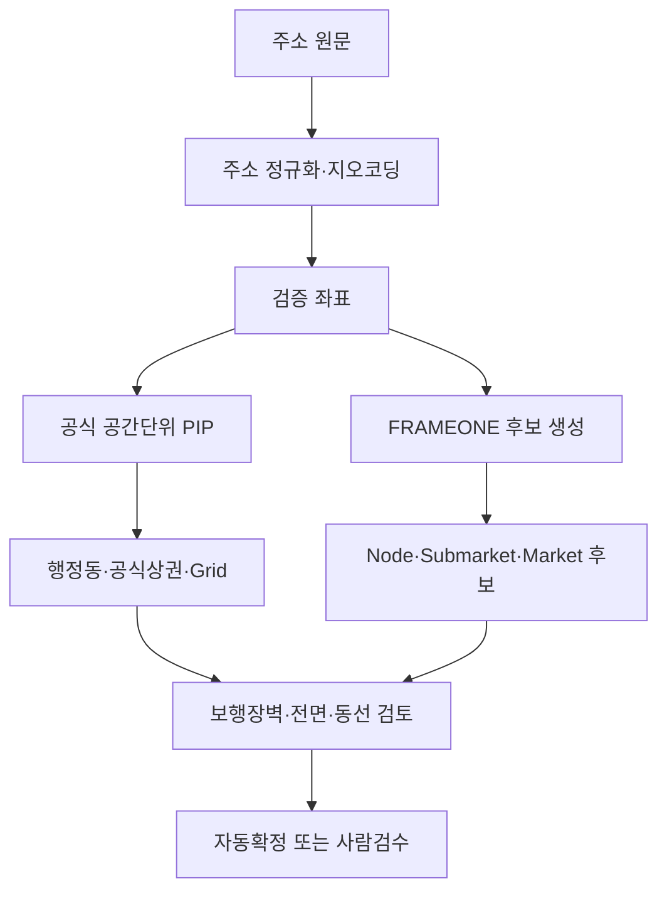

# FRAMEONE 서울 상권분석 STEP 2~7 마스터 조사보고서

**기준선:** 서울 상권 DB v1.1 (2026-08-27)
**재검증 기준일:** 2026-08-27
**개발 기준 커밋:** `8dde56e feat: add Seoul market hierarchy explorer`
**범위:** 조사·공간데이터 검증·분석모델·개발명세. 프로그램 코드는 수정하지 않음.

## 1. 최종 요약

| 판단 항목 | 결론 |
|---|---|
| STEP 2~7 개발 가능 범위 | 스키마, 상태관리, 지도 레이어 골격, 주소→공식공간단위 매칭, 데이터 적재 파이프라인, 위험판단 엔진 골격은 개발 가능 |
| 데이터 부족 범위 | FRAMEONE Market/Submarket Polygon, Node 검증주소·좌표, Pilot 25의 확정 공간중첩비, API 키 기반 실호출 |
| Pilot 25 공간DB 가능성 | 2단계 방식으로 가능. 먼저 검증점·공식 참조관계, 이후 수동 승인 Polygon. 현재 일괄 Polygon 생성은 불가 |
| 새로 재확인한 공식자료 | 서울 생활인구 250m, 서울 상권 영역·점포·매출·길단위인구·직장인구, 소진공 상가업소, 건축HUB, 지방행정 인허가 |
| 우선순위 변경 | 지도 UI보다 먼저 `geometry verification workflow`와 2023 SHP↔2024+ 코드 버전 방어 로직을 구현 |
| Codex 즉시 착수 | 데이터 타입 확장, 검증상태 표시, 레이어 레지스트리, 매칭 결과의 후보/확정 분리, Risk V2 순수함수·테스트 |
| 사람 검수 필수 | Market/Submarket 경계 승인, Node 의미·주소, 대로 양측·역 출구·보행장벽, 배기·전기·급배수·인허가 |
| 다음 순서 | STEP 2 상태·검수도구 → STEP 3 Viewer → STEP 4 공식데이터 적재 → STEP 5 경쟁점 → STEP 6 주소매칭 → STEP 7 판정결합 |

## 2. 확인된 사실

- v1.1 계층은 District 25 / active Market 156 / Submarket 382 / Node 763이며 기존 검증 결과를 그대로 유지한다.
- FRAMEONE Market 156, Submarket 382, Node 763은 모두 `text_only`이고 자체 좌표·Polygon을 보유하지 않는다.
- 공식 참조 geometry는 서울시 공식상권 1,650개, 행정동 425개, 생활인구 250m Grid 10,125개가 로컬에 존재한다.
- 기존 Market↔행정동 458행, Market↔공식상권 863행은 이름 기반 `manual_review` 후보이며 공간중첩 수치가 없다.
- 서울 생활인구는 특정 시점·지역에 존재하는 인구의 추계치이며 시간·성별·연령 분석에 활용할 수 있다. 공식 안내는 250m 격자 약 8,500개라고 설명하므로, 로컬 geometry 10,125개와 수치 데이터의 실제 키 커버리지는 적재 전에 대조해야 한다. [서울 생활인구 공식 안내](https://data.seoul.go.kr/dataVisual/seoul/seoulLivingPopulation.do)
- 서울 상권분석서비스는 2024년부터 표준단위구역을 사용한다. 2026-07-03 제공기준 변경 후 추정매출 등은 2021년 이후 자료를 제공한다. [영역-상권](https://data.seoul.go.kr/dataList/OA-15560/S/1/datasetView.do), [추정매출-상권](https://data.seoul.go.kr/dataList/OA-15572/S/1/datasetView.do)
- 점포-상권 데이터는 점포 수, 개·폐업, 프랜차이즈 정보를 제공한다. [점포-상권](https://data.seoul.go.kr/dataList/OA-15577/S/1/datasetView.do)
- 소상공인시장진흥공단 상가(상권)정보는 영업 중인 전국 상가업소의 상호, 업종코드, 주소, 경위도 등을 제공한다. 폐업 이력 원천으로 단독 사용해서는 안 된다. [상가(상권)정보 파일](https://www.data.go.kr/data/15083033/fileData.do), [Open API](https://www.data.go.kr/data/15012005/openapi.do)

## 3. STEP별 결론

### STEP 2 — Pilot 25 공간데이터

- 권장 상태는 한 개 enum이 아니라 `geometry_availability`, `verification_stage`, `review_status` 3축으로 분리한다.
- `verified_reference`는 FRAMEONE 경계가 검증됐다는 뜻으로 오해될 수 있어 사용하지 않는다. 공식 geometry와의 관계는 별도 Crosswalk로 관리한다.
- Pilot별 대표점은 공식 앵커 주소를 지오코딩하고 사람이 지도에서 승인한 경우에만 `verified_point`로 승격한다.
- Market Polygon은 공식상권 합집합을 자동 복사하지 않는다. 포함·제외 기준, 보행장벽, 도로 양측, 역 출구, 실제 소비동선을 사람이 승인해야 한다.

### STEP 3 — 지도 Viewer

- 6개 레이어는 독립적으로 on/off 가능해야 하며 FRAMEONE 분석권역과 서울시 공식상권을 같은 색·범례로 표시하지 않는다.
- `geometry=null` 객체는 지도에서 숨겨 버리지 말고 검색목록과 상세패널에서 `공간데이터 없음`으로 노출한다.
- 지도 클릭 결과에는 경계 버전, 원천, 검증일, 상태, confidence, 미확인 항목, 연결된 Crosswalk를 표시한다.

### STEP 4 — 생활인구·공식상권 연결

- 원칙적 집계는 Polygon intersection + 면적가중이다.
- 인구 수치는 균등분포 가정의 한계를 기록하고, 가능하면 원천 격자별 총량을 `intersection_area/grid_area`로 가중한다.
- 포인트·도로·건물 밀도 지표는 면적가중과 분리한다. 점포는 Point-in-Polygon, 도로 접근은 네트워크/현장검수 대상이다.
- 2023-10 geometry와 2024+ 표준단위구역 지표 코드는 버전 호환표가 검증되기 전 join 금지다.

### STEP 5 — 경쟁점·창폐업

- 1차: 서울 점포-상권의 서비스업종 코드로 제과점/커피·음료를 분기·상권 단위 집계한다.
- 2차: 소진공 상가업소 개별 좌표로 현재 경쟁점 분포를 산출한다.
- 3차: 지방행정 인허가의 제과점·휴게음식점 영업상태/폐업일로 업소 이력을 보완한다.
- `베이커리카페`, `디저트`, `대형`, `개인`은 공식 업종코드만으로 완전 분류할 수 없다. 상호·업태·시설·프랜차이즈 명부를 결합하되 규칙기반 후보와 사람검수를 분리한다.
- 포화도는 점포 수 단독값이 아니라 수요 대비 밀도, 4~8분기 개·폐업, 매출 추세, 상위 브랜드 집중도, 현장 관찰을 함께 본다.

### STEP 6 — 후보 점포 자동매칭

- 주소가 하나의 행정동/Grid에 속하는 것은 자동확정 가능하지만, FRAMEONE Market은 검증 Polygon이 있을 때만 PIP 자동확정한다.
- 복수 Market 중첩, 경계 20m 이내, 폭 25m 이상 대로 인접, 교량·철도·하천 장벽, 지하/복합몰, 출입구 방향 미확인은 검수 큐로 보낸다.
- 최단거리 하나로 확정하지 않고 `polygon containment → 접근 가능한 출입구/도로망 → 앵커 연결 → 현장검수` 순으로 판단한다.

### STEP 7 — 입지→계약판단

- 점수는 영역별 설명과 비교에만 사용한다. Hard Risk가 있으면 총점으로 상쇄하지 않는다.
- Hard Risk는 `confirmed`, `suspected`, `cleared`, `not_checked`로 관리한다.
- `confirmed` 치명 위험 1개는 원칙적으로 `위험`; 해결 가능한 전제조건이면 `조건부 추천`이 아니라 계약 전 `보류`로 둔다.
- `suspected/not_checked` 핵심 시설·인허가 항목은 `보류`; 확인 완료 후 재판정한다.
- 최종 판정은 근거, 데이터 기준일, 추정치 범위, 전문가 확인항목을 함께 저장한다.

## 4. 공간중첩 방식 비교

| 방식 | 장점 | 한계 | 사용처 |
|---|---|---|---|
| Point in Polygon | 빠르고 명확 | 경계·입구·도로 양측 효과 미반영 | 점포, Node, 후보주소의 기본 소속 |
| Polygon intersection | 실제 겹침 관계 표현 | 유효 geometry와 동일 CRS 필요 | Market↔공식상권/행정동/Grid |
| 면적가중 | 구현 단순, 재현 가능 | 격자 내 인구 균등분포 가정 | 생활인구·등록인구 1차 추정 |
| 인구가중 | 실제 수요분포에 근접 | 더 세밀한 원천 또는 dasymetric 보정 필요 | 고도화 단계 |
| 중심점 포함 | 빠름 | 큰 격자·가느다란 경계에서 누락 | 탐색용 후보만 허용 |

## 5. 변경기록

| 항목 | 기존 | 재검증 결과 | 처리 |
|---|---|---|---|
| 계층/ID/개수 | v1.1 확정 | 충돌 없음 | 변경 없음 |
| FRAMEONE geometry | 전부 text_only | 공식 근거만으로 자동 생성 불가 | 변경 없음 |
| 공식상권 geometry | 2023-10 SHP | 2024+ 지표는 표준단위구역 체계 | 자동 join 금지 강화 |
| 생활인구 Grid 수 | 로컬 10,125 | 공식 소개는 약 8,500개 | 키·유효기간 실데이터 대조 전 수치 집계 중단 |
| 서울 상권 지표 제공기준 | 확인 필요 | 2026-07-03 변경 공지 확인 | source_version 필수화 |

## 6. 사람이 반드시 검수할 사항

- Pilot 25 Market의 포함·제외 블록과 경계선
- Submarket의 앵커·역 출구·도로·생활권 의미
- Node가 실제 점포, 도로동선점, 앵커, 역 출구 중 무엇인지
- 대로변 양측, 지하연결, 철도·하천·경사·횡단보도 등 보행장벽
- 배기·전기·급배수·장비반입·제조공간·소방·위생·건축물 용도
- 임대차 특약, 원상복구, 권리금, 관리비, 실제 월세 구조

## 7. 개발 착수 결론

`PROGRAM DEVELOPMENT: READY`는 유지한다. 다만 이는 **UI·스키마·검수 워크플로·공식데이터 적재 골격 개발 가능**을 뜻하며, Pilot 25의 수치분석·자동 Market 확정이 가능하다는 뜻은 아니다. Codex는 STEP 2부터 순서대로 착수하되 각 단계의 중단조건을 지켜야 한다.
