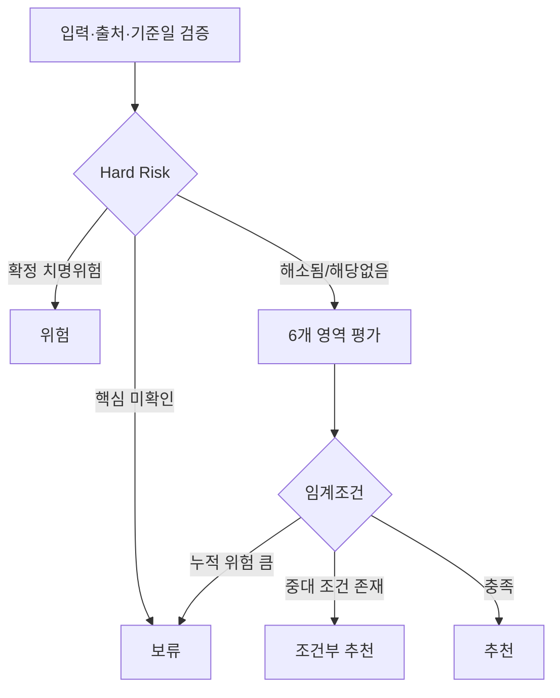

# RISK MODEL V2 SPEC

**목적:** 입지·경쟁·점포·시설·임대차·재무를 결합하되 치명 위험을 평균점수로 상쇄하지 않는 계약 전 판정 모델

## 1. 판정 구조



## 2. 영역별 평가

| 영역 | 주요 지표 | 점수의 역할 |
|---|---|---|
| 입지 | 생활인구, 배후세대, 직장인구, 동선, 접근성, 가시성 | 비교·설명용 |
| 경쟁 | 베이커리 밀도, 주요 경쟁점, 개·폐업, 프랜차이즈 비중 | 포화·차별화 진단 |
| 점포 | 전면, 층, 주차, 간판, 출입구·접근 | 점포상품성 진단 |
| 시설 | 전기, 급배수, 배기, 제조공간, 장비반입 | Hard Risk 게이트 우선 |
| 임대차 | 월세, 관리비, 권리금, 원상복구, 특약 | 계약조건 게이트 포함 |
| 재무 | BEP, 월세부담률, 고정비, 권리금 회수기간 | 시나리오 기반 게이트 |

각 영역은 0~100 점수와 `data_coverage`를 별도로 가진다. 데이터 커버리지가 낮으면 점수를 낮추지 말고 `판정 불확실성`을 높인다.

## 3. Hard Risk

| 코드 | 위험 | confirmed 처리 | suspected/not_checked 처리 |
|---|---|---|---|
| HR-EXHAUST | 제조형인데 적법·실행 가능한 배기 불가 | 위험 | 보류 |
| HR-POWER | 필요 전기용량 확보 불가 | 위험 | 보류 |
| HR-WATER | 필요한 급배수 불가 | 위험 | 보류 |
| HR-PERMIT | 예정 업종 인허가 불가 가능성이 공식 확인됨 | 위험 | 보류·관할 확인 |
| HR-DELIVERY | 오븐 등 핵심 장비 반입 불가 | 위험 | 보류 |
| HR-PRODUCTION | 최소 제조공간·안전동선 확보 불가 | 위험 | 보류 |
| HR-FINANCE | 보수 시나리오 BEP가 현실적 영업능력을 현저히 초과 | 위험 또는 보류 | 보류 |

`confirmed`는 현장 사진만으로 확정하지 않는다. 전기·소방·배기·급배수·건축·위생은 관련 전문가 또는 관할기관 확인근거를 연결한다.

## 4. 일반 Risk

- 경쟁과다, 낮은 가시성, 2층 이상, 주차 부족, 높은 관리비, 짧은 계약기간, 과도한 원상복구, 권리금 회수기간 장기화 등은 가중 위험이다.
- 동일 원인에서 파생된 지표를 중복 가산하지 않는다. 예: 높은 월세와 높은 월세부담률은 같은 재무원인을 공유하므로 상한을 둔다.
- 상권점수가 높아도 시설·인허가·재무 Hard Risk는 상쇄하지 않는다.

## 5. 재무 시나리오

최소 `보수/기준/낙관` 3개 시나리오를 사용한다. 예상매출은 확정값이 아니라 범위로 저장한다.

```text
손익분기매출 = 월 고정비 / (1 - 변동비율)
월세부담률 = (월세 + 관리비 중 고정성 비용) / 예상 월매출
권리금 회수 추정기간 = 권리금 / 월 잉여현금흐름
```

- 월 잉여현금흐름이 0 이하이면 회수기간은 숫자로 만들지 않고 `회수 추정 불가`로 표시한다.
- 부가세 포함/별도, 대표자 인건비, 대출이자, 감가상각, 배달·카드수수료 포함 여부를 명시한다.
- 임계값은 사업모델별(제조판매형/카페결합형/테이크아웃형) 검증 전 고정하지 않는다.

## 6. 최종 판정 규칙

| 판정 | 필요조건 |
|---|---|
| 추천 | Hard Risk cleared/해당없음, 핵심데이터 충족, 중대한 계약조건 없음, 보수·기준 시나리오가 허용범위 |
| 조건부 추천 | 해결 가능하고 계약서·공사·가격협상 조건으로 명확히 잠글 수 있는 위험만 존재 |
| 보류 | 핵심 Hard Risk 미확인, 공간매칭 모호, 주요 수치 부족, 전문가·임대인 확인 전 계약 금지 |
| 위험 | 치명위험 확정, 해결 불가 또는 비용·법적 위험이 사업구조를 훼손 |

## 7. 출력 필수값

- verdict, verdict_reasons, hard_risks, conditions_precedent
- 영역별 점수와 data_coverage
- 추정치 범위와 가정
- source_ids, 기준일, stale 여부
- 전문가 확인 목록
- 재판정에 필요한 자료와 담당자

## 8. 테스트

- 상권 95점 + 배기불가 → 위험
- 입지 우수 + 전기 미확인 → 보류
- 월세 조정 특약 체결 시만 성립 → 조건부 추천
- 모든 핵심 확인 완료, 보수 시나리오 충족 → 추천
- 데이터 부족을 0점으로 처리하지 않는지 확인
- 동일 위험의 중복가산 방지 확인
