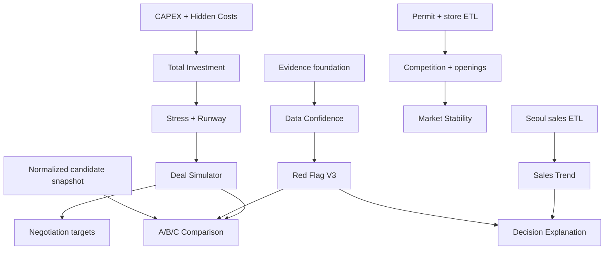

# FRAMEONE MASTER FEATURE ROADMAP

기준일: 2026-09-02  
제품목표: **베이커리 창업자가 후보점포를 계약하기 전에 돈을 잃을 가능성이 높은 문제를 찾아내고, 계약조건을 어떻게 바꾸면 되는지 설명하는 점포개발 의사결정 시스템**.

## 1. 대표 결론

전체 흐름은 현실적으로 구현 가능하다.

```text
고객조건 → 후보주소 → 상권/경쟁/수요 → 임대차·시설·도면·장비
→ 투자비·BEP·Stress → Evidence·Hard Risk
→ 비교·협상 Simulation → 계약판정
→ 지원사업·인허가·공사·오픈 → 1/3/6/12개월 실제성과
```

그러나 동시에 만들면 실패한다. 가장 먼저 필요한 것은 더 많은 상권차트가 아니라 **근거(Evidence), 비상쇄 Risk, 숨은 투자비, 보수적 현금흐름, 협상조건**이다.

## 2. 현재 프로그램에 붙이는 개념 Engine

Engine은 장기적 개념경계다. 기존 폴더·DB·UI를 전면 교체하지 않는다.

| 개념 Engine | 역할 | 기존 결합점 | 초기 구현 방식 |
|---|---|---|---|
| MARKET | 상권·추정매출·인구·경쟁·개폐업 | `/markets`, Viewer, 300/500m | 기존 API/화면에 metric 모듈 추가 |
| SITE | 점포·접근·가시·현장 | `candidateStore` | 필드/evidence 확장 |
| FACILITY | 전기·배기·급배수·소방·장비·도면·CAPEX | `facilityCheck` | risk/cost/evidence 연결 |
| DEAL | 임대차·권리금·렌트프리·협상 | `candidateStore`, `breakEven` | scenario snapshot 추가 |
| FINANCE | 투자·BEP·손익·운전자금·Stress | `breakEven`, calculator | 순수 계산함수 확장 |
| DECISION | Hard Risk·Confidence·판정·설명 | `risk`, `report` | Risk V3 병행 후 전환 |
| OPENING | 계약·공사·장비·행정·지원·오픈 | case/report 주변 | 작은 stage/task table |
| GROWTH | 플레이스·콘텐츠·리뷰·3개월·actuals | marketing/향후 | 최소 actual capture부터 |

## 3. 핵심 설계

### 3.1 Evidence System

사용자 예시의 `VERIFIED`, `ESTIMATED`, `OWNER_STATEMENT`, `FIELD_CHECK`, `DOCUMENT`는 한 enum에 넣지 않는다. 전자는 검증상태, 후자는 출처유형이다.

```text
evidence
- evidence_id
- case_id / candidate_store_id
- subject_type / subject_id / field_path
- asserted_value_json / unit
- verification_status
    VERIFIED | ESTIMATED | UNKNOWN | CONFLICTED | STALE
- source_type
    DOCUMENT | FIELD_CHECK | PHOTO | OWNER_STATEMENT |
    TENANT_STATEMENT | EXPERT_STATEMENT | PUBLIC_DATA |
    SYSTEM_CALCULATION | CUSTOMER_INPUT
- source_ref / attachment_id / source_url
- checked_by / checked_at
- effective_at / expires_at
- note
- supersedes_evidence_id
```

예:

```text
field: facility.electricCapacity
value: 30 kW
verification: VERIFIED
source: PHOTO + FIELD_CHECK
source_ref: 분전반 사진 #P-182
checked_by: FRAMEONE 직원
checked_at: 2026-09-02
```

`OWNER_STATEMENT`는 확인됨이 아니다. 공식문서·현장측정과 충돌하면 `CONFLICTED`이며 Risk가 올라간다.

### 3.2 자료확인도

목적은 성공확률이 아니라 판단자료의 완성도다.

\[
EvidenceCoverage = \frac{\sum_i w_i f(status_i)}{\sum_i w_i}\times100
\]

초기 정책 예:

- VERIFIED 1.0
- ESTIMATED 0.5
- 진술만 있고 미검증 0.35
- STALE 0.25
- UNKNOWN/CONFLICTED 0

이 계수는 경험적 정책이며 전문가 검증·버전 관리한다. 전체 비율보다 `critical field coverage`가 우선이다.

```text
자료 확인도 82% — 계약 성공확률이 아닙니다.
확인 23 / 추정 4 / 미확인 5
핵심 미확인: 배기, 전기증설, 소방
판정: 보류
```

### 3.3 Red Flag Engine V3

```text
CRITICAL
- 제조형 + 배기 불가가 확인됨
- 필요한 전력 확보 불가가 확인됨
- 계획 영업의 중대한 법적/관리규약 문제 확인
- 핵심 장비 반입 불가 확인
- 중대한 피난·안전 문제 확인
- 보수적 총투자액이 가용자금을 초과하고 조달계획 없음

HIGH
- 배기/전기/관리규약 등 critical field UNKNOWN
- 시설추가비 high 범위가 예산을 현저히 초과
- BEP가 근거 있는 예상매출 범위를 크게 초과
- 보수 scenario runway가 policy threshold 미달

MEDIUM
- 주차·간판·가시성·경쟁심화 등 해결/수용 가능한 risk
```

판정은 score 합계보다 gate 우선:

```text
if CRITICAL confirmed: RISK
else if critical evidence UNKNOWN: HOLD
else evaluate HIGH + finance viability: HOLD / CONDITIONAL
else RECOMMEND / CONDITIONAL
```

기존 가산식 Risk를 즉시 삭제하지 않는다. 동일 fixture에 V2와 V3를 병행 실행하고 차이를 검토한 뒤 report의 authoritative decision을 V3로 전환한다.

### 3.4 Investment Engine

통합 범위:

- 시설 CAPEX Risk.
- Hidden Cost Finder.
- Budget Guard.

각 비용은 `확정/견적/범위추정/미확인`과 `low/base/high`를 갖는다.

```text
investment_line_item
- category / subcategory
- amount_low / amount_base / amount_high
- estimate_status       CONFIRMED | QUOTED | RANGE_ESTIMATE | UNKNOWN
- basis                 supplier_quote | own_history | expert_rule | manual
- included_in_other_item
- vat_included
- evidence_ids[]
```

비용 catalog:

- 보증금(회수가능 현금묶임), 권리금, 중개보수.
- 철거·폐기물·설계·감리·인테리어.
- 전기증설·분전반·냉난방·배기·덕트·후드.
- 급수·배수·그리스트랩·가스·소방·방화·방수.
- 화장실·바닥·천장·간판·장비반입·원상복구.
- 장비·POS·보안·카드단말.
- 초기재료·포장재·초도마케팅·보증금·예비운전자금.

합계:

\[
TotalInvestment_{low/base/high}=\sum included\ line\ items
\]

이는 확률구간이 아니라 현재 입력·범위의 산술 합계다. 상관관계가 반영된 통계적 confidence interval로 표현하지 않는다.

Budget Guard:

```text
초기예산 1.5억
확정 1.2억 + 예상추가 base 0.4억 = 1.6억
예산초과 가능성 base 0.1억 / high 0.3억
```

### 3.5 Finance Engine V2

기존 계산을 보존·확장한다.

\[
MonthlySales = UnitPrice \times DailyVisitors \times OperatingDays
\]

\[
VariableRate = MaterialRate + CardRate + DeliveryRate
\]

\[
FixedCost = Rent + Maintenance + Labor + Ads + OtherFixed
\]

\[
BEP = \frac{FixedCost}{1-VariableRate}
\]

\[
OperatingProfit = Sales(1-VariableRate)-FixedCost
\]

추가:

- 보수 `Sales×0.8`, 기준, 긍정 `Sales×1.2`.
- positive scenario가 Hard Risk를 상쇄하지 않음.
- 월세부담률 `rent/sales`, 단 0·누락 처리.
- 권리금 회수기간은 양의 **정의된 상환가능 현금흐름**이 있을 때만 계산.

운전자금:

\[
CashRemaining = TotalAvailableCash - InitialCashOutflow
\]

\[
RunwayMonths = \frac{CashRemaining}{MonthlyNetCashBurn_{conservative}}
\]

매출 ramp가 입력되지 않으면 0매출/보수매출 두 기준을 나란히 보여준다. “최소 3개월/6개월”을 법칙으로 선언하지 않고 FRAMEONE policy band를 전문가 검토 후 별도 표시한다.

### 3.6 Deal Simulator

통합 범위: What-if, 렌트프리, 목표조건 역산, 협상 round.

변경 가능:

- 보증금·월세·관리비·권리금·렌트프리·계약기간.
- 인테리어·장비·시설공사.
- 객단가·방문객·영업일·원가율·인건비·수수료·광고·고정비.

보호장치:

- `market-derived`, `customer-supported`, `user hypothetical` 가정을 구분.
- 예상매출을 올려 판정을 개선하면 evidence 경고.
- 합리적 범위 밖 값은 차단보다 경고+승인 이유를 저장.
- base scenario를 덮어쓰지 않고 version 생성.

렌트프리:

\[
RentFreeValue = MonthlyBaseRent \times FreeMonths
\]

관리비·VAT도 면제되는지는 계약에 명시된 경우만 포함한다.

\[
OccupancyCash_H = Rent(H-FreeMonths) + Maintenance\times H + OtherOccupancy
\]

보증금은 비용이 아니라 현금묶임으로 별도 표시하고, 선택적으로 명시된 자금비용만 계산한다.

```text
안 A: 월세 450, 렌트프리 0
안 B: 월세 500, 렌트프리 3
24개월 rent-only: A 10,800 / B 10,500만원
25개월 이후 누적관계 재역전 가능 → horizon 표시
```

### 3.7 목표 계약조건 역산

“적정 월세/권리금”이 아니라 `현재 손익가정에서 부담 가능한 참고범위`다.

월세 상한 후보:

\[
Rent_{burden}=Sales_{conservative}\times TargetRentBurden
\]

\[
Rent_{profit}=Sales_{conservative}(1-v)-OtherFixed-TargetProfit
\]

\[
SuggestedRentCeiling=min(Rent_{burden}, Rent_{profit})
\]

TargetRentBurden와 TargetProfit은 FRAMEONE policy/고객 목표이며 객관적 시장적정값이 아니다.

권리금 참고상한:

\[
PremiumReference = EligibleMonthlyCashFlow_{conservative}\times MaxPaybackMonths
\]

세전/세후, 대표자 인건비, 감가, 대출원리금의 포함범위를 명시한다. 현금흐름이 0 이하이면 상한을 0으로 단정하기보다 `회수기준 산출불가`로 표시한다.

### 3.8 후보점포 비교

- 2개: 세부 비교.
- 3개: PC 기본·상담 최적.
- 5개: PC 최대, shortlist용.
- 6개 이상: 먼저 filter하여 5개 이하로 줄임.

PC: 고정 첫 열(항목), 후보 3열, 차이 강조, 그룹 접기.  
모바일: 후보 2개 pair compare 또는 후보 switch; 5열 압축 금지.  
PDF: landscape 3개 기본, 4~5개는 요약 1장 + 후보별 appendix.

정렬 우선:

1. CRITICAL/HIGH.
2. 핵심 미확인.
3. 총투자 high와 runway.
4. BEP·월세부담·stress.
5. 상권·경쟁·수요.

총점으로 추천 순위를 결정하지 않는다.

### 3.9 Decision Explanation

항상 다음 구조:

```text
현재 판정
긍정 요소
위험 요소
계약 전 반드시 해결할 것
협상하면 좋아지는 조건
해결되면 검토 가능한 다음 판정
근거·기준일·미확인
```

`해결되면 추천`을 확정하지 않고 `조건부 추천 검토 가능`처럼 rule 재평가 결과로 표현한다.

## 4. 현장·도면·장비

### 4.1 사진 Evidence

필수 후보: 건물/점포 전면, 출입구, 내부, 천장, 분전반, 수도, 배수, 배기 위치, 화장실, 후면, 반입경로, 엘리베이터, 계단, 주차, 간판.

입력: 전면·층고·출입문폭·내부폭/깊이·기둥·급배수·전기·배기·반입.  
사진 metadata: 촬영일, 담당자, 항목, 메모, 선택 GPS.

오프라인 UX:

- 로컬 draft와 업로드 queue.
- 후보점포 short code/QR로 case 연결.
- GPS는 동의 후 위치 sanity check만.
- 음성원문과 전사문 분리.
- 완료 시 미촬영/UNKNOWN/CONFLICT 자동 task.

### 4.2 도면 Layer

출입구·창문·기둥·화장실·급수·배수·배기·전기·분전반·오븐·믹서·발효기·냉장/냉동·쇼케이스·계산대·포장대·창고·고객/직원동선.

연결 event:

```text
오븐 이동 → cable/배기/급배수 연결거리 변경
→ facility impact proposal
→ CAPEX line item 변경
→ Total Investment/Runway 재계산
→ Decision rerun
```

초기에는 자동 공사견적이 아니라 `영향 가능성 + 확인요청`만 생성한다.

### 4.3 장비 반입

장비: 폭·깊이·높이·중량·전력·전압·급수·배수·배기.  
점포: 문·엘리베이터·계단·회전공간·층고·바닥하중 확인상태.

단순 gate:

- 모든 path segment clear width/height가 장비 포장치수+안전여유 이상인지.
- 회전이 필요한 경우 bounding box 1차검사.
- 중량/하중·해체반입·크레인 등은 전문가 확인.

결과: `1차 통과 / 확인 필요 / 치수상 불가 가능성`, 최종은 배베스토리·업체.

## 5. 문서·Due Diligence

계약서/관리규약:

```text
upload → 격리 → OCR/layout → schema extraction
→ page+bbox 근거 → staff confirm → current input conflict
→ missing clause questions → expert review link
```

AI는 구조화와 누락질문만 한다. 배기설치 허용, 업종제한, 원상복구, 중도해지 등의 법적 효력을 판단하지 않는다.

계약준비 gate는 건축물/영업형태/관리규약/임대차/전기/배기/급배수/소방/반입/총투자/BEP를 점검한다. 핵심 미완료 시 `READY`가 되지 않는다.

## 6. Opening Workspace Lite

stage:

```text
LEAD → CONSULTING → SITE SEARCH → SITE ANALYSIS → DUE DILIGENCE
→ NEGOTIATION → CONTRACT → DESIGN → PERMIT → CONSTRUCTION
→ EQUIPMENT → OPENING PREPARATION → OPEN → 1 MONTH → 3 MONTH
```

각 stage에 담당자, 완료일, 다음작업, 미해결 Risk만 둔다. 칸반, 시간추적, 범용 채팅, 복잡한 권한상속 등은 만들지 않는다.

Deal Room Lite는 후보별 문서 index이며 범용 문서관리 SaaS가 아니다.

Opening Readiness는 task completion:

\[
Readiness=completed\ applicable\ weights / applicable\ weights
\]

CRITICAL task가 미완료면 95%여도 blocker를 표시한다.

## 7. 고객용·직원용·Meeting Mode

| 직원용 | 고객용 |
|---|---|
| Raw data·계산식·rule trace | 핵심 판정·쉬운 그래프 |
| 모든 Evidence·Confidence | 확인/추정/미확인 요약 |
| 내부메모·충돌·source | 핵심 Risk·추가비·BEP |
| 모든 scenario·override | 비교결과·계약 전 행동 |
| 원천/ETL 품질 | 공식 출처·주의문 |

Meeting Mode:

```text
A/B/C 요약 → 핵심차이 → 선택 후보 What-if → Hard Risk
→ 협상조건 → 잠정선택 → 다음 확인작업
```

편집·Raw source는 숨기고 scenario 저장/되돌리기만 제공한다.

자동 상담 briefing:

- 시작 전: 오늘 확인할 7가지, 후보간 핵심차이, 미확인 Hard Risk.
- 종료 후: 결정내용, 추가확인, 고객이 제공할 자료, 담당자/기한.
- 모든 항목은 case fact/rule에서 생성하고 자유로운 추측을 금지.

협업사 전달:

- 주소·면적·도면·전기·급배수·배기·장비·사진.
- 확인 요청과 빠진 항목.
- 고객동의·수신자 확인·공개범위가 선행.

## 8. Learning Loop

최소 수집:

- 계약 전 prediction snapshot: 월매출, 객단가, 고객수, BEP, 원가율, 인건비, 월세, 광고, CAPEX.
- actual: 1/3/6/12개월 매출·핵심비용·운영상태. 초기에는 매월 상세입력 금지.

\[
ErrorPct=(Actual-Predicted)/Predicted\times100
\]

Phase:

1. actual 수집과 결측/탈락 관리.
2. cohort 통계·bias/calibration.
3. rules/assumptions version 보정.
4. 충분한 표본·대표성 후 ML.

실패점포가 응답하지 않는 survivor bias와 자기보고 오류를 기록한다. Similar Store는 P3이며, 지금은 feature schema와 consent만 설계한다.

## 9. 베이커리 특화 후속

### Production Capacity

장비 cycle, batch size, 발효·굽기, 작업대, 직원수·숙련, 제조시간, SKU mix를 bottleneck model로 계산한다. 결과는 `180~220개/일` 같은 범위이며 배베스토리 검증 전 고객판정에 직접 쓰지 않는다.

### 메뉴 경제성

\[
Contribution = Price - Ingredient - Packaging - VariableFee - ExpectedWaste
\]

제조시간과 설비 bottleneck을 별도 표시. AI가 원가·폐기율을 생성하지 않는다.

## 10. Dependency Graph



## 11. FRAMEONE 다음 개발기능 TOP 10

### 1) Evidence + Data Confidence

1. 필요: 임대인 진술·추정·현장확인을 구분하지 않으면 모든 판단이 흔들린다.  
2. 참고: 전문 DD의 provenance 개념, 공공서비스의 출처표기.  
3. 차이: 수치마다 사진/서류/확인자/시점과 Hard Risk field를 연결.  
4. 현재 가능: A.  
5. 데이터: 기존 입력 + evidence metadata.  
6. 난이도: 중.  
7. 순서: 최우선.  
8. 사용: 상담자는 전기 30kW의 근거사진을 열고 고객은 `확인됨` badge를 본다.

### 2) Red Flag Engine V3

1. 필요: 현재 가산식은 치명위험 상쇄 가능성이 있다.  
2. 참고: 경쟁사 risk/등급, 시설 DD.  
3. 차이: CRITICAL non-offsetting gate.  
4. 현재 가능: A.  
5. 데이터: facility, deal, finance, evidence.  
6. 난이도: 중.  
7. 순서: Evidence 뒤.  
8. 사용: 배기불가가 확인되면 높은 상권지표와 무관하게 위험.

### 3) Investment Engine

1. 필요: 계약 뒤 나타나는 시설·숨은비용이 큰 손실을 만든다.  
2. 참고: 외식/베이커리 컨설팅·상업부동산 DD.  
3. 차이: 시설 risk→low/base/high→Budget Guard.  
4. 현재 가능: 구조 A, 견적 DB B/C.  
5. 데이터: 자체/배베스토리/업체 견적.  
6. 난이도: 중.  
7. 순서: Evidence와 병행.  
8. 사용: “전기·배기 high 포함 시 예산 3천만원 초과 가능”.

### 4) Stress Test + Working-Capital Runway

1. 필요: 기준 예상매출 하나는 낙관 편향.  
2. 참고: 수익계산기·재무 stress 개념.  
3. 차이: 투자 후 남는 현금과 보수 scenario를 계약 gate에 연결.  
4. 현재 가능: A.  
5. 데이터: 기존 breakEven + 총가용현금.  
6. 난이도: 낮음~중.  
7. 순서: Investment 합계 뒤.  
8. 사용: “보수 scenario에서 runway 0.7개월”.

### 5) Deal Simulator

1. 필요: 보류를 끝내지 않고 해결가능 조건을 제시.  
2. 참고: 마이프차/OPENUP 계산기 개념.  
3. 차이: 임대·CAPEX·운영·렌트프리·협상 round를 통합.  
4. 현재 가능: A.  
5. 데이터: 기존 deal/breakEven/Investment.  
6. 난이도: 중.  
7. 순서: Finance V2 뒤.  
8. 사용: 월세 600→500, 권리금 8천→5천, free 2개월의 판정변화.

### 6) Candidate Comparison

1. 필요: 현장에서는 A/B/C 중 하나를 골라야 한다.  
2. 참고: 마이프차 비교·부동산 매물비교.  
3. 차이: 단일 총점 없이 Hard Risk·투자·runway 우선.  
4. 현재 가능: A.  
5. 데이터: normalized case snapshots.  
6. 난이도: 중.  
7. 순서: Risk/Finance/Deal 뒤.  
8. 사용: 3열 Meeting Mode에서 B를 잠정선택.

### 7) Decision Explanation

1. 필요: 판정명보다 이유·해결조건이 중요.  
2. 참고: OPENUP PRO/NICE AI 해설.  
3. 차이: deterministic rule trace + 숫자 validator.  
4. 현재 가능: A.  
5. 데이터: engine facts.  
6. 난이도: 낮음~중.  
7. 순서: Red Flag와 Deal 뒤.  
8. 사용: “배기확약+월세50 조정 시 조건부 추천 재검토”.

### 8) Competition + Open/Close

1. 필요: 실제 베이커리 과밀·회전을 계약 전에 확인.  
2. 참고: OPENUP·서울·마이프차.  
3. 차이: 핵심/광의/검토중과 인허가 기준을 투명 표시.  
4. 현재 가능: B.  
5. 데이터: 인허가+소진공+self DB.  
6. 난이도: 중.  
7. 순서: Market P1 첫 단계.  
8. 사용: 250/500m 경쟁과 최근 신규·폐업 확인.

### 9) Seoul Estimated Sales Trend

1. 필요: 상권의 최근 방향을 정량근거로 확인.  
2. 참고: OPENUP·서울.  
3. 차이: 추정/공간단위/영역변경을 숨기지 않고 BEP 질문과 연결.  
4. 현재 가능: B.  
5. 데이터: 서울 OA-15572/22175.  
6. 난이도: 중.  
7. 순서: Competition과 병행.  
8. 사용: 공식상권 최근 4개분기 합계 변화 확인.

### 10) Due Diligence + Mobile Evidence

1. 필요: 계약 직전 미확인 시설·문서를 차단.  
2. 참고: 상업부동산 실사·민간 현장컨설팅.  
3. 차이: 베이커리 전기/배기/급배수/반입 사진 필수.  
4. 현재 가능: A/B.  
5. 데이터: task/photo/document.  
6. 난이도: 중~높음.  
7. 순서: Evidence schema 뒤.  
8. 사용: 현장에서 촬영 후 추가확인 task 자동생성.

## 12. 당장 개발 TOP 5 / 상권완료 후 TOP 5

### 당장 개발 TOP 5

1. Evidence + Confidence foundation.
2. Red Flag Engine V3.
3. Investment Engine.
4. Stress Test + Runway.
5. Deal Simulator 기본형.

Candidate Comparison과 Decision Explanation은 위 기반을 이어받는 P0 후반이다.

### 현재 상권기능 완료 후 TOP 5

1. 인허가+상가 canonical 경쟁점과 신규/폐업.
2. 서울 추정매출 QoQ/YoY/TTM.
3. 100/250/300/500m Micro Market.
4. Due Diligence + Mobile Evidence.
5. 도면·시설·장비·CAPEX 연결.

### 2027년 이후 고려

- 카드/통신/POS/배달 계약 기반 분포·미세격자.
- 충분한 actuals 후 Similar Store/매출 calibration ML.
- Production Capacity 고도화.
- 메뉴 경제성과 SKU/bottleneck.
- 다점포 cannibalization.

### 개발하지 않을 기능

- 법률·인허가 자동 확정.
- 창업 성공확률/생존확률.
- 경쟁사 값·UI·데이터 복제.
- 민간 분포 없는 상위20% 가짜지표.
- 범용 CRM/DMS/PM SaaS.
- 공공 총액을 억지로 100m 실제매출 heatmap으로 변환.
- 지원사업 자동 대리신청.

## 13. 대표 브리핑 — FRAMEONE에서 실제 만들 수 있는 경쟁사 핵심 기능

| 기능 | 만들 수 있나? | 무엇으로? | 한계 | 개발시기 |
|---|---|---|---|---:|
| 분기 추정매출 추이 | 예, B | 서울 추정매출 ETL+자체 변화율 | 실제/반경/점포매출 아님 | P1 |
| 경쟁점 지도 | 예, B | 인허가+상가업소+self DB | 업태분류·중복검수 | P1 |
| 신규·폐업 | 예, B/C | 인허가일·폐업일 | 신고일 기준·지연 | P1 |
| 250m Micro Market | 예, B/C | grid+반경+SGIS/서울 | 경계·시점·보행장벽 | P1 |
| Bakery Market Stability | 제한적, C | 3년 개폐업·기간·밀도 | 생존확률 아님 | P1 후반 |
| 매출 Heatmap | 공식상권은 예 | polygon+서울 추정매출 | 미세 실제매출 아님 | P1 후반 |
| 중위·상위20% | 공공만으로 불가 | 민간 점포분포 | 계약·표본·privacy | P3 |
| AI 상권 해설 | 예, A/B | DB metric facts+validator | 입력오류는 별도 검증 | P0/P1 |
| 후보 A/B/C 비교 | 예, A | 기존 case snapshot+gate | 결측 bias 관리 | P0 |
| Deal Simulator | 예, A | 기존 임대·BEP+scenario | 가정범위·근거 필요 | P0 |
| CAPEX/Hidden Cost | 예, A/B | 시설폼+self 견적 DB | 견적 전 범위값 | P0 |
| Evidence/Confidence | 예, A | 사진·문서·현장 metadata | 성공확률 오인 방지 | P0 |
| 계약서/관리규약 AI | 제한적, B/C | OCR+schema+page citation | 법률판단 불가 | P1/P2 |
| 지원사업 추천 | 예, B | K-Startup+기업마당 API | 최종자격은 기관 | P2 |
| 개업 Navigator | 예, A/B | 정부24·공식 content registry | 관할·법령변경 | P2 |
| 실제성과 Learning | 수집부터 가능 | 1/3/6/12개월 actuals | 표본·survivor bias | P2/P3 |

### 당장 만들 수 있는 TOP 10

1. Evidence schema.
2. 자료확인도와 critical coverage.
3. Red Flag V3.
4. Hidden Cost checklist.
5. Budget Guard.
6. Stress Test.
7. Working-capital runway.
8. 렌트프리 누적비용 계산.
9. Deal Simulator 기본형.
10. 후보점포 비교 기본형.

### API 추가 후 가능한 TOP 10

1. 서울 추정매출 4/12분기.
2. QoQ/YoY/TTM.
3. 시간/요일 소비.
4. 소진공 현재 경쟁점.
5. 지방인허가 신규·폐업.
6. 관찰 영업기간.
7. 100/250/300/500m 경쟁 band.
8. SGIS 인구·사업체 보조.
9. K-Startup 공고 매칭.
10. 기업마당 공고 briefing.

### 민간데이터가 있어야 가능한 기능

- 개별 경쟁점 매출.
- 평균·중위·상/하위20%.
- 정밀 100m 카드매출 heatmap.
- 통신 실시간/시간대/OD 유동인구.
- POS 메뉴·객단가·판매량 분포.
- 배달 매출·비중.

### 굳이 만들 필요 없는 기능

- 범용 부동산 AI 시세/투자가치.
- 상권 총점 하나와 창업 성공확률.
- 화려하지만 계약판단과 연결되지 않는 heatmap.
- 범용 프로젝트관리/CRM.
- 지원사업 자동 신청대행.
- 초기 데이터 없는 Similar Store/ML 예상매출.

### FRAMEONE 차별화 TOP 10

1. 비상쇄 Hard Risk.
2. Evidence Graph.
3. 자료확인도와 핵심 미확인 gate.
4. 시설 CAPEX+Hidden Cost+Budget Guard.
5. Stress+runway.
6. Deal Simulator+협상목표.
7. gate 기반 후보비교.
8. 도면·장비·시설 비용연결.
9. 해결조건 중심 Decision Explanation.
10. 예측→실제 Learning Loop.

## 14. MASTER ROADMAP

### 현재

| 기능 | 데이터 | 선행 | 효과 | 완료기준 |
|---|---|---|---|---|
| 기존 candidateStore→facility→breakEven→risk→report 안정화 | 기존입력 | 없음 | 기준선 | fixture와 보고서 일관 |
| Market/Submarket/Node·Viewer 완성 | 자체 서울DB | 현재 개발 | 공간기반 | 주소→영역→metric 추적 |

### P0 — 계약 손실방지

| 기능 | 데이터 | 선행 | 예상효과 | 완료기준 |
|---|---|---|---|---|
| Evidence+Confidence | 입력·사진·문서 | schema | 미확인 오판 감소 | critical field status 100% |
| Red Flag V3 | facility/deal/finance | Evidence | 치명위험 비상쇄 | critical fixture 통과 |
| Investment Engine | 견적범위 | Evidence | 숨은비용·예산통제 | low/base/high·중복제거 |
| Stress+Runway | breakEven+현금 | Investment | 낙관계약 방지 | 3 scenario·0분모 안전 |
| Deal Simulator | deal/finance | Stress | 협상조건 도출 | base 불변·scenario version |
| Candidate Comparison | snapshots | Risk/Deal | 실제 후보 선택 | 3개 기본·5개 최대·gate |
| Decision Explanation | rule facts | Risk/Deal | 고객 이해·행동 | 모든 숫자 evidence ID |

### P1 — Market·현장·시설 경쟁력

| 기능 | 데이터 | 선행 | 예상효과 | 완료기준 |
|---|---|---|---|---|
| 경쟁점+개폐업 | 인허가+상가 | taxonomy/ETL | 과밀·회전 | 표본분류·source 추적 |
| 추정매출 trend | 서울 분기자료 | ETL/영역버전 | 성장방향 | 추정 라벨·2024 경고 |
| Micro Market | SGIS/서울 grid | 경쟁점 | 도보수요 | 4 bands·시점/한계 |
| Due Diligence+Mobile | 사진/문서 | Evidence | 현장누락 차단 | offline·추가확인 task |
| 도면/장비/시설 | specs/dimensions | Investment | 반입·공사비 발견 | 1차검토+전문가 gate |
| 고객/직원/Meeting | 모든 engine | Compare | 상담 효율 | 권한·정보수준 분리 |
| Deal Room Lite | attachments | Evidence | 자료정리 | 범용DMS 기능 제외 |

### P2 — 개업·지원·자체데이터

| 기능 | 데이터 | 선행 | 예상효과 | 완료기준 |
|---|---|---|---|---|
| 지원사업 매칭/briefing | K-Startup/기업마당 | 공고 DB | 탐색시간 감소 | PASS/FAIL/UNKNOWN+원문 |
| Startup Navigator | 정부24/법령 | content registry | 절차누락 감소 | 관할/effective date |
| Opening Pipeline/Readiness | tasks | Navigator | 계약후 실행 | blocker 우선 |
| 계약서/규약 AI | 문서 | Evidence/보안 | 누락질문 | page/bbox+staff confirm |
| Production Capacity | 전문가 DB | 장비 | 제조현실성 | range+expert validation |
| Actuals 최소수집 | 고객동의 | prediction snapshot | 장기학습 | 1/3/6/12개월·탈락기록 |

### P3 — 민간데이터·학습

| 기능 | 데이터 | 선행 | 예상효과 | 완료기준 |
|---|---|---|---|---|
| 매출분포·상위/중위 | 카드/POS | 계약/표본검증 | BEP percentile | coverage·privacy·재배포 |
| 정밀 유동/heatmap/배달 | 통신/카드/배달 | 계약 | 미세 수요 | 원천·보정·한계 |
| Similar Store/ML | sufficient actuals | Learning phases 1–3 | 보정 | holdout/calibration/bias |
| 메뉴 경제성 고도화 | POS/원가/공정 | capacity | 운영수익 | 실제값만 사용 |

## 15. 최종 완료 정의

FRAMEONE이 완성됐다고 보는 조건은 기능 수가 아니다.

1. 고객이 A/B/C 중 무엇을 왜 선택하는지 이해한다.
2. CRITICAL risk와 핵심 미확인이 계약 전에 표면화된다.
3. 시설 추가비와 남는 운전자금이 범위로 계산된다.
4. 조건을 바꾸면 같은 계산식으로 판정이 재현된다.
5. 추정/실제, 공공/민간/자체, 확인/미확인이 혼동되지 않는다.
6. AI의 모든 숫자·조항이 DB/evidence로 역추적된다.
7. 계약 후 업무와 actuals가 최소 입력으로 이어진다.

